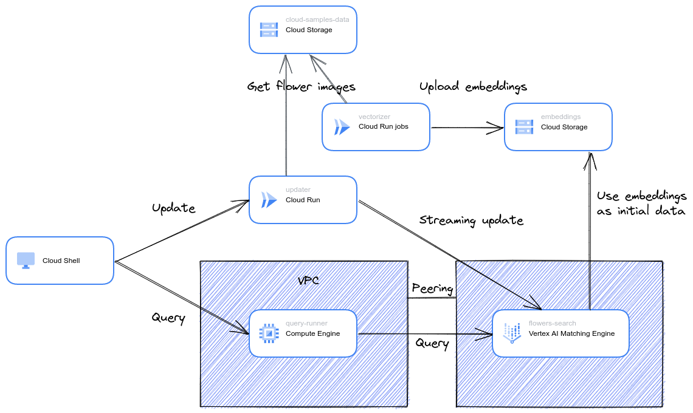

# Example for Vertex AI Matching Engine

In this tutorial, you will build an application for similar image search using [Vertex AI Matching Engine](https://cloud.google.com/vertex-ai/docs/matching-engine/overview), which provides high-scale, low-latency Approximate Nearest Neighbor search.

## Tutorial on Cloud Shell

English:

Japanese:

## Architecture

